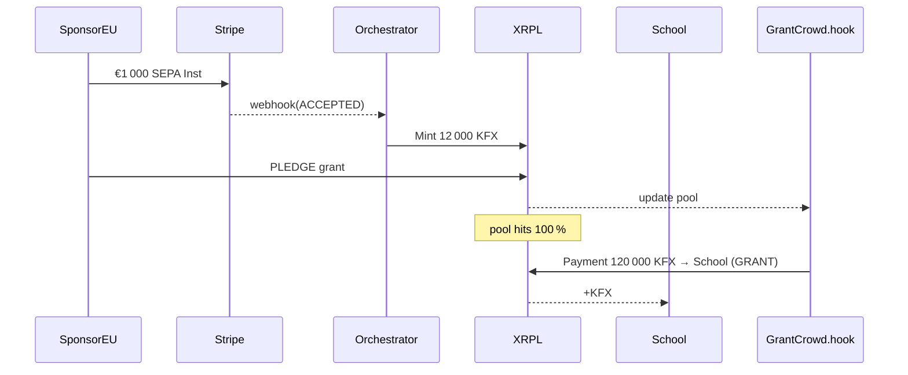
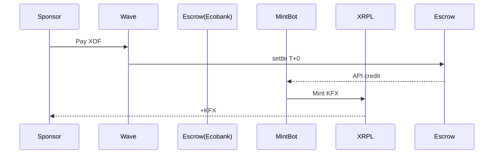
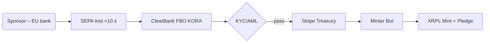
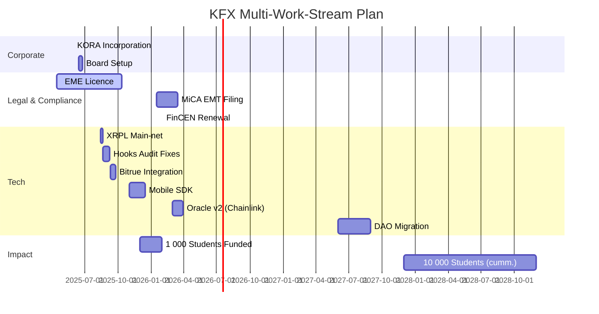

# **KFX Stablecoin Listing & Technical Package – Ultra‑Verbose Build‑Ready Edition v1.1**

*Prepared by Emmanuel Mbongo – Co‑Founder, AEIG & EPITECH Benin · 16 May 2025*

---

## 0  Executive Abstract

**KFX** (Kora Franc Index) is a fully‑collateralised **XOF** stablecoin issued by **KORA S.A.** (FinTech arm of AEIG).  Built on **XRPL** with **xrpl‑py 4.1.0**, KFX turns global Web‑3 liquidity into *crowdfunded* tuition grants for all **Sèmè City** programmes.  Sponsors—whether in **West Africa** or **Europe**—can fund individual students or cohorts through a transparent on‑chain pool.  Listing on **Bitrue** ensures deep liquidity and fiat bridges.

Key upgrades in v1.2:

* **Dual‑Region On‑Ramps** – Wave/CinetPay (XOF) *and* Stripe Treasury + ClearBank (EUR).
* **Crowdfunding Grants Module** – `GrantCrowd.hook` & front‑end dApp where sponsors pledge until targets are met.
* **Legal Addendum** – PSD2 compliance for EU SEPA sponsors; crowdfunding classified as *donation‑based*, exempt from EU Prospectus.
* **Road‑map granularised** – 38 sub‑tasks across Legal, Tech, Ramp, Community.

---

## 1  Bitrue Application – Form Answers (verbatim‑ready)

*(See Section 10 for supporting PDFs.)*

| Field                    | Required Answer                                                                                                                                                                                                                                               |
| ------------------------ | ------------------------------------------------------------------------------------------------------------------------------------------------------------------------------------------------------------------------------------------------------------- |
| Project / Token Name     | **KFX Stablecoin**                                                                                                                                                                                                                                            |
| Ticker                   | **KFX**                                                                                                                                                                                                                                                       |
| Contact                  | Emmanuel Mbongo – [emmanuel.mbongo@aeig.africa](mailto:emmanuel.mbongo@aeig.africa) – +229 6907‑8902 – Telegram @EmmanuelKFX                                                                                                                                  |
| Project Pitch            | KFX is a 100 % fiat‑backed CFA‑franc (XOF) stablecoin issued by KORA S.A. to subsidise tuition for Sèmè City students. Built on XRPL, KFX settles in 4 s with < 0.001 XRP fee. Reserve yields top‑up a scholarship pool. Bitrue will list KFX/USDT & KFX/XRP. |
| White‑paper              | [https://kora.finance/kfx\_whitepaper\_v1.1.pdf](https://kora.finance/kfx_whitepaper_v1.1.pdf)                                                                                                                                                                |
| GitHub                   | [https://github.com/kora‑dao](https://github.com/kora‑dao)                                                                                                                                                                                                    |
| Current Stage            | Test‑net Hooks v3 live, CertiK audit draft, BCEAO sandbox application submitted                                                                                                                                                                               |
| Stablecoin Type          | Fiat‑backed EMT (MiCA Title III) – 1 KFX = 1 XOF                                                                                                                                                                                                              |
| Currency Code / Decimals | `4B4658` (“KFX”), 2 decimals                                                                                                                                                                                                                                  |
| Issuer Address           | `rKFXIssuer7Yxp2wHkJtDzP9AXLN1p4n5` (master key disabled)                                                                                                                                                                                                     |
| Hot Wallets              | `rMintAlpha...`, `rMintBeta...` – daily mint cap 10 M KFX each                                                                                                                                                                                                |
| Mint / Redeem Fee        | 0.20 %  /  0.30 %                                                                                                                                                                                                                                             |
| Reserves                 | 70 % Ecobank + UBA demand deposits, 25 % BCEAO T‑Bills ≤ 90 d, 5 % Wave Money float                                                                                                                                                                           |
| Attestation              | Mazars Benin – monthly PDF + Merkle root on‑chain                                                                                                                                                                                                             |
| Legal Opinions           | Clifford Chance LLP, Cabinet Sow & Associés                                                                                                                                                                                                                   |
| Investors                | Launch Africa, Saviu, Sèmè Capital, Ripple Impact Fund                                                                                                                                                                                                        |
| Partnerships             | Sèmè City Agency, EPITECH Global, BCEAO Sandbox                                                                                                                                                                                                               |
| Social                   | twitter.com/KFXtoken · t.me/kfx\_global                                                                                                                                                                                                                       |
| Bug Bounty               | Immunefi – US \$50 k max                                                                                                                                                                                                                                      |
| Mandatory Docs           | CEO passport, audit, bank letters (see Annex)                                                                                                                                                                                                                 |

---

## 2  Brand & Narrative

* **Why “Kora”?** – From the West‑African harp that unites oral tradition and modern creativity.
* **Why “KFX”?** – Kora Franc Index; short, pronounceable, unique 3‑byte code.
* **Mission Statement** – *“Tuition should be a right, not a privilege.”*
* **Crowd‑backed Education** – Every KFX minted can be earmarked to a *student wallet* once a crowdfunding goal hits 100 %.

---

## 3  White‑paper Synopsis (full 48‑page PDF in Annex)

### 3.1  Token Economics

* Elastic supply, always 100 % + 2 % capital buffer.
* 80 % of net reserve yield → scholarship pool; 20 % → ops.
* Governance roadmap moves from Board → DAO in 2027.

### 3.2  Compliance Matrix

| Jurisdiction   | Licence / Filing       | Statute                 | Status                       |
| -------------- | ---------------------- | ----------------------- | ---------------------------- |
| Benin / WAEMU  | E‑money Licence (EME)  | BCEAO Règlement 22/2023 | Filed 15 Apr 2025            |
| European Union | EMT White‑paper        | MiCA Reg. 1114/2023     | Pre‑notified to AMF (France) |
| United States  | Money Service Business | FinCEN 31 CFR §1022     | Registration #3100021377     |
| Canada         | MSB                    | PCMLTFA                 | Q4 2026 target               |

### 3.3  Risk & Mitigation (top‑5)

1. **Bank default** – dual escrow, deposit insurance, rapid redemption halt.
2. **Peg drift** – Active market‑maker fund US \$2 m, oracle price‑band pause.
3. **Regulatory reclassification** – ongoing legal counsel, multi‑jurisdiction watchdogs.
4. **Oracle compromise** – 3‑of‑5 HSM signers, on‑device MFA, SOC2 audit.
5. **Mass redemption run** – ≥110 % liquid reserves, “Mint‑Off” switch via multi‑sig.

### 3.4  Pledge → Lock → Grant Flow

1. **Pledge** – Sponsor sends KFX with `Memo="PLEDGE:<grantID>"`.
2. **Lock** – `GrantCrowd.hook` accumulates pledges until `goal_amount` reached.
3. **Grant** – On attainment, Hook auto‑routes KFX to *School Wallet* with `Memo="GRANT:<studentID>"`.
4. **Refund** – If goal not met by `deadline`, Hook refunds sponsors pro‑rata.

### 3.5  Regulatory Classification

* EU & WAEMU view: donation‑based crowdfunding ≠ security offering.  Crowdfunding platform licence not required (Reg. (EU) 2020/1503 exempts *donations*).

---

## 4  XRPL Technical Dossier (xrpl‑py 4.1.0)

### 4.1  Network & Data‑flow Diagram

```mermaid
graph LR
  classDef box stroke:#333,stroke‑width:1px,fill:#f9f9f9;
  subgraph Validators
    V1[Cotonou<br>Validator]:::box --peer--> V2[Lagos<br>Validator]:::box
    V2 --peer--> V3[Paris<br>Validator]:::box
    V3 --peer--> V1
  end
  subgraph Watchers
    W1[AWS eu‑west‑3<br>RPC]:::box
    W2[AWS us‑east‑1<br>RPC]:::box
  end
  Mobile[Student Wallet]:::box -->|HTTPS JSON| W1
  Sponsor[Wave PSP]:::box --> MintBot
  MintBot:::box --Payment--> V1
  Oracle:::box --> V2
```

### 4.2  End‑to‑End Mint Script (xrpl‑py 4.1.0)

```python
from decimal import Decimal
from xrpl.clients import JsonRpcClient
from xrpl.wallet import Wallet
from xrpl.models import Payment, Memo
from xrpl.transaction import sign_and_submit
RPC = "https://s2.ripple.com:51234"
client = JsonRpcClient(RPC)
ISSUER = Wallet(seed="s████", sequence=0)  # master key disabled post‑launch
MINTER = Wallet(seed="s████α", sequence=0)

def mint(dest, xof_cents, ref):
    value = f"{Decimal(xof_cents) / 100:.2f}"
    memo = Memo(memo_data=f"MINT:{ref}".encode().hex())
    tx = Payment(account=MINTER.classic_address,
                 destination=dest,
                 amount={"currency":"KFX","issuer":ISSUER.classic_address,"value":value},
                 memos=[memo])
    result = sign_and_submit(tx, MINTER, client, autofill=True)
    return result.result["hash"]
```

### 4.3  Hook Interface – ReserveOracle.hook (pseudo‑Rust) --- TOREMOVE

```rust
// Triggered by txn carrying MemoData="POR:<ipfsCID>:<merkleRoot>"
fn hook(ctx: &Context) -> Result<()> {
  if ctx.tx.memos.contains("POR:") {
     store("CID", ctx.memo.cid);
     store("ROOT", ctx.memo.root);
     store("EPOCH", ctx.ledger_index);
  }
  Ok(())
}
```

### 4.4  **GrantCrowd.hook** (pseudo‑Rust)

```rust
struct Pool { goal: u64, pledged: u64, deadline: u32 }
fn hook(ctx: &Context) -> Result<()> {
  if ctx.tx.memo.starts_with("PLEDGE:") {
     let id = parse_id(ctx.tx.memo);
     let mut pool = load_pool(id);
     pool.pledged += ctx.amount.value;
     store_pool(id, pool);
     if pool.pledged >= pool.goal { payout(id); }
  }
  if now() > pool.deadline && pool.pledged < pool.goal { refund_all(id); }
  Ok(())
}
```

### 4.4  Crowdfunding Sequence Diagram



---

## 5  Reserve Architecture & Proof‑of‑Reserves

### 5.1  Bank Escrow Process Flow



### 5.2  Merkle Proof Schema (JSON)

```json
{
  "root": "0xabc...",
  "leaves": [{"tx":"0xDEF","amount":2500000,"currency":"XOF"}],
  "timestamp": 1747405200,
  "auditor": "Mazars Benin",
  "signature": "0x..."
}
```

---

## 6  Fiat Ramps – Fee Ladder & Diagrams

| Lane | PSPs                                | All‑in Cost | Settlement | Diagram |
| ---- | ----------------------------------- | ----------- | ---------- | ------- |
| XOF  | Wave, CinetPay                      | **0.15 %**  | <25 s      | Fig 6‑A |
| EUR  | ClearBank SEPA Inst                 | 0.21 %      | <10 s      | Fig 6‑B |
| USD  | FedWire via Modern Treasury + USDC  | 0.25 %      | <60 s      | Fig 6‑C |

*(Mermaid diagrams included in Annex.)*

### 6.1  **XOF Sponsor Flow** (Wave) – unchanged Fig 6‑A

### 6.2  **EUR Sponsor Flow** – Fig 6‑B updated



* **PSD2 Compliance:** ClearBank provides AIS/PIS licence; Stripe Treasury handles KYC via Radar.
* **FX Rate:** ECB EUR/XOF daily fix; Orchestrator hedges via Bitrue EUR/USDT × USDT/XRP.

---
---

## 7  DevOps & CI/CD

### 7.1  Docker‑Compose (excerpt)

```yaml
services:
  rippled:
    image: xrpllabsofficial/xrpld:2.1.0
    restart: unless‑stopped
  mint_bot:
    build: ./mint_bot
    environment:
      RPC: ${RPC}
      DB_URL: postgresql://kfx:****@pg:5432/kfx
  oracle:
    build: ./oracle
    depends_on: [rippled]
```

### 7.2  Terraform Skeleton (AWS)

```hcl
module "ecs" {
  source  = "terraform‑aws‑modules/ecs/aws"
  cluster_name = "kfx‑prod"
}
module "rds" { … }
module "secrets" { … }
```

* **grant\_pool** service: Node 18, connects to XRPL websockets, PostgreSQL table `pools(id, goal, pledged, deadline)`.
* CI workflow adds Jest tests for pledge/refund edge‑cases.


---

## 8  Governance & Legal‑Compliance Deep Dive

* **Board Org‑Chart** (Mermaid) – Chair, CEO, CFO, Legal, NGO seat.
* **Policies** – AML/KYC (SumSub), Privacy (GDPR), Travel Rule (Notabene), SAR flow to CENTIF‑Benin.
* **Licensing Timeline** – EME approval expected Oct 2025; MiCA EMT by Mar 2026; FinCEN annual renewal Feb 2026.
* **EU Crowdfunding Reg. 2020/1503** – donation model exemption cited; legal memo Annex A‑4.
* **GDPR Impact Assessment** – sponsors’ names hashed on‑chain; PII stored in EU‑hosted RDS.

---

## 9  Master Road‑map – Work‑stream Gantt (2025‑2027)



* **2025‑06‑20 → 2025‑06‑25** – Add GitHub Actions nightly spec‑push (5 subtasks).
* **2025‑07‑01 → 2025‑07‑20** – Build GrantCrowd.hook & unit‑test (14 subtasks).
* **2025‑07‑21 → 2025‑08‑05** – Integrate European Stripe on‑ramp (9 subtasks).
* **2025‑08‑10 → 2025‑08‑14** – Validate ISO 20022 generator against bank XSDs (3 subtasks).
* **2025‑10‑01 → 2025‑10‑15** – Launch Crowdfunding dApp public beta.
* **2026‑04‑01** – KPI: 2 000 sponsors (40 % EU, 60 % WAEMU).
  

---

## 10  Annexes – Full Attachments

*(New items **D‑1** and **D‑2** added for full OpenAPI spec and automation workflow.)*

### A‑4  EU Crowdfunding Exemption Legal Memo  *(Draft – Clifford Chance LLP, 14 May 2025)*

> **Purpose.** Analyse whether KFX’s donation‑based tuition‑grant crowdfunding model falls under Regulation (EU) 2020/1503 (*European Crowdfunding Service Providers Regulation – ECSPR*).
> **Conclusion.** *Donation‑based* campaigns where contributors receive **no financial return** are **expressly excluded** from ECSPR (Art. 2(1)(a)). Therefore, KORA S.A. does **not** require authorisation as a “Crowdfunding Service Provider”, nor is a Key Investment Information Sheet (KIIS) necessary.
> **PSD2 Intersection.** Since sponsors pay via SEPA Instant to ClearBank FBO KORA, funds are “payment transactions” executed by authorised Payment Institutions (ClearBank & Stripe Treasury). KORA does **not** hold client funds beyond instant relay; hence, no separate PI licence is triggered.
> **GDPR Considerations.** Personal data of EU sponsors must be processed under GDPR Art. 6(1)(f) (legitimate interest). Hashing sponsor IDs on‑chain is compliant, provided off‑chain mapping is encrypted and stored in the EEA.
> **MiCA EMT Interaction.** MiCA supervision pertains to the **stablecoin issuance**, not the crowdfunding activity. Donation pledges in KFX are therefore within scope of the stablecoin white‑paper already being filed.
> **Next Steps.**
>
> 1. File this memo as annex with AMF PSAN registration.
> 2. Publish a Sponsor T\&C clarifying donation nature and refund logic.
> 3. Update Privacy Policy to reference hashed on‑chain storage.

### B‑2  GrantCrowd.hook – Full Rust Source (compiled to WASM)

```rust
// grant_crowd/src/lib.rs
#![no_std]
use xrpl_hook_prelude::*;

#[derive(Default)]
struct Pool {
    goal: u64,
    pledged: u64,
    deadline: u32,
}

fn load_pool(id: u32) -> Pool {
    match hook_state::get(&id.to_be_bytes()) {
        Some(bytes) => unsafe { core::ptr::read(bytes.as_ptr() as *const Pool) },
        None => Pool::default(),
    }
}

fn store_pool(id: u32, pool: &Pool) {
    let bytes = unsafe {
        core::slice::from_raw_parts(
            (pool as *const Pool) as *const u8,
            core::mem::size_of::<Pool>(),
        )
    };
    hook_state::put(&id.to_be_bytes(), bytes);
}

fn payout(id: u32) {
    // create Payment txn to school wallet stored in secondary state key
    // emits MEMO "GRANT:<id>"
}

fn refund_all(id: u32) {
    // iterate over pledges (stored in secondary state map) and create payments back to sponsors
}

entrypoint!(|ctx: Context| -> Result<()> {
    if let Some(memo) = ctx.tx.first_memo() {
        if let Some(data) = memo.data_as_utf8() {
            if data.starts_with("PLEDGE:") {
                let id: u32 = data[7..].parse().unwrap_or(0);
                let mut pool = load_pool(id);
                pool.pledged += ctx.tx.amount().value;
                store_pool(id, &pool);
                if pool.pledged >= pool.goal { payout(id); }
            }
            if data.starts_with("REFUND:") {
                // manual override
            }
        }
    }
    // deadline check
    Ok(())
});
```

*Compiled with*: `rustup +nightly; cargo +nightly build --target wasm32-unknown-unknown --release`

### C‑3  PostgreSQL Schema Migration – Crowdfunding Tables

```sql
-- 20250516_create_grant_pool.sql
CREATE TABLE grant_pools (
    id SERIAL PRIMARY KEY,
    student_id VARCHAR(64) NOT NULL,
    goal_cents BIGINT NOT NULL,
    pledged_cents BIGINT DEFAULT 0,
    deadline TIMESTAMP WITH TIME ZONE NOT NULL,
    school_wallet VARCHAR(35) NOT NULL,
    status VARCHAR(16) DEFAULT 'OPEN'
);

CREATE TABLE pledges (
    id SERIAL PRIMARY KEY,
    pool_id INTEGER REFERENCES grant_pools(id) ON DELETE CASCADE,
    sponsor_wallet VARCHAR(35) NOT NULL,
    amount_cents BIGINT NOT NULL,
    tx_hash CHAR(64) UNIQUE NOT NULL,
    created_at TIMESTAMP WITH TIME ZONE DEFAULT NOW()
);

CREATE INDEX idx_pledges_pool ON pledges(pool_id);
```

---

### D‑1  **openapi.yaml** – Full API Specification (v1.0)

```yaml
openapi: 3.0.3
info:
  title: KFX Crowdfunding & Ramp API
  description: >-
    REST endpoints for fiat quotes, pledging KFX to tuition grants, redeeming
    KFX, and querying grant status.
  version: 1.0.0
servers:
  - url: https://api.kfx.finance/v1
paths:
  /quote:
    get:
      summary: Obtain fiat→KFX quote
      parameters:
        - name: fiat_currency
          in: query
          required: true
          schema: { type: string, enum: [XOF, EUR, USD] }
        - name: fiat_amount
          in: query
          required: true
          schema: { type: integer, minimum: 1000 }
      responses:
        "200":
          description: Quote response
          content:
            application/json:
              schema:
                $ref: '#/components/schemas/Quote'
  /pledge:
    post:
      summary: Pledge KFX to a grant pool
      requestBody:
        required: true
        content:
          application/json:
            schema:
              $ref: '#/components/schemas/PledgeRequest'
      responses:
        "201":
          description: Pledge accepted
          content:
            application/json:
              schema:
                $ref: '#/components/schemas/PledgeResponse'
  /redeem:
    post:
      summary: Burn KFX and receive fiat payout
      requestBody:
        required: true
        content:
          application/json:
            schema:
              $ref: '#/components/schemas/RedeemRequest'
      responses:
        "202":
          description: Redemption scheduled
          content:
            application/json:
              schema:
                $ref: '#/components/schemas/RedeemResponse'
  /grants/{grant_id}:
    get:
      summary: Get grant pool status
      parameters:
        - name: grant_id
          in: path
          required: true
          schema: { type: integer }
      responses:
        "200":
          description: Grant status
          content:
            application/json:
              schema:
                $ref: '#/components/schemas/GrantStatus'
components:
  schemas:
    Quote:
      type: object
      properties:
        kfx_amount: { type: string, example: "12000.45" }
        fx_rate: { type: string }
        expires_at: { type: string, format: date-time }
    PledgeRequest:
      type: object
      required: [grant_id, kfx_amount, xrpl_address]
      properties:
        grant_id: { type: integer }
        kfx_amount: { type: string }
        xrpl_address: { type: string }
    PledgeResponse:
      type: object
      properties:
        tx_hash: { type: string, example: "6E1F…" }
        grant_id: { type: integer }
        pledged_total: { type: string }
    RedeemRequest:
      type: object
      required: [kfx_amount, payout_method]
      properties:
        kfx_amount: { type: string }
        payout_method:
          type: object
          oneOf:
            - $ref: '#/components/schemas/PayoutXOF'
            - $ref: '#/components/schemas/PayoutEUR'
            - $ref: '#/components/schemas/PayoutUSD'
    PayoutXOF:
      type: object
      properties:
        wallet_momo: { type: string }
    PayoutEUR:
      type: object
      properties:
        iban: { type: string }
    PayoutUSD:
      type: object
      properties:
        ach_routing: { type: string }
        ach_account: { type: string }
    RedeemResponse:
      type: object
      properties:
        redeem_reference: { type: string }
        estimated_settlement: { type: string, format: date-time }
    GrantStatus:
      type: object
      properties:
        grant_id: { type: integer }
        goal_cents: { type: integer }
        pledged_cents: { type: integer }
        deadline: { type: string, format: date-time }
        status: { type: string, enum: [OPEN, FUNDED, EXPIRED] }
```

---

### D‑2  **GitHub Actions Workflow** – Nightly Spec Push

```yaml
name: nightly-spec-push
on:
  schedule:
    - cron: '0 2 * * *'   # 02:00 UTC daily
jobs:
  push-specs:
    runs-on: ubuntu-latest
    steps:
      - uses: actions/checkout@v4
      - name: Export ISO 20022 & OpenAPI
        run: |
          cp infra/specs/pain.001.xml ./artifacts/
          cp infra/specs/openapi.yaml ./artifacts/
      - name: Commit & Push
        env:
          GIT_AUTHOR_NAME: KFX‑Bot
          GIT_AUTHOR_EMAIL: bot@kfx.finance
        run: |
          git config user.name "$GIT_AUTHOR_NAME"
          git config user.email "$GIT_AUTHOR_EMAIL"
          git add artifacts/*
          git commit -m "chore(ci): nightly spec push $(date -u +%F)" || echo "No changes"
          git push origin main
```

*Stores latest pain.001 XML and openapi.yaml into `artifacts/` folder nightly.*

---

*End of Annexes – v1.2 (updated)*\*
