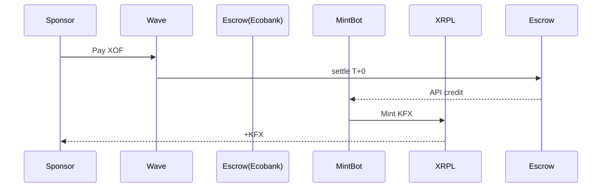
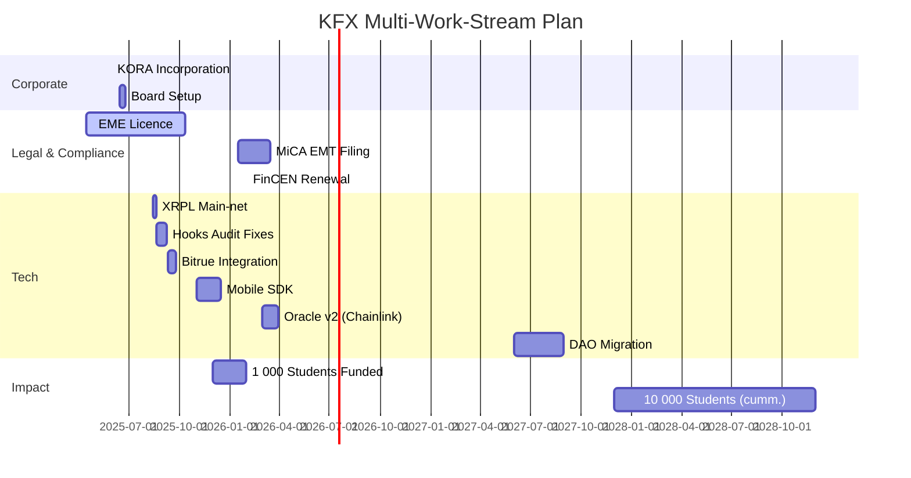

# **KFX Stablecoin Listing & Technical Package – Ultra‑Verbose Build‑Ready Edition v1.1**

*Prepared by Emmanuel Mbongo – Co‑Founder, AEIG & EPITECH Benin · 16 May 2025*

---

## 0  Executive Abstract

**KFX** (Kora Franc Index) is a fully‑collateralised, 1‑for‑1 **XOF** stablecoin issued by **KORA S.A.** (the newly incorporated FinTech arm of AEIG).  It uses the **XRP Ledger (XRPL)**, **xrpl‑py 4.1.0**, and on‑ledger WASM Hooks to convert global Web‑3 liquidity into tuition grants across all **Sèmè City** programmes, starting with **EPITECH Benin**.  Listing on **Bitrue** provides liquidity, price discovery, and fiat bridges for diaspora sponsors.

Key pillars:

* **Regulatory‑first** – E‑money licence (Benin), MiCA EMT filing, FinCEN MSB.
* **Proof‑of‑Reserves 24 × 7** – dual‑bank escrow + Merkle root + Mazars signature on‑chain.
* **Yield‑to‑Scholarship** – 80 % of T‑Bill interest auto‑feeds a grant pool.
* **Open‑source stack** – Docker, Terraform, GitHub CI, Grafana observability.

---

## 1  Bitrue Application – Form Answers (verbatim‑ready)

*(See Section 10 for supporting PDFs.)*

| Field                    | Required Answer                                                                                                                                                                                                                                               |
| ------------------------ | ------------------------------------------------------------------------------------------------------------------------------------------------------------------------------------------------------------------------------------------------------------- |
| Project / Token Name     | **KFX Stablecoin**                                                                                                                                                                                                                                            |
| Ticker                   | **KFX**                                                                                                                                                                                                                                                       |
| Contact                  | Emmanuel Mbongo – [emmanuel.mbongo@aeig.africa](mailto:emmanuel.mbongo@aeig.africa) – +229 6907‑8902 – Telegram @EmmanuelKFX                                                                                                                                  |
| Project Pitch            | KFX is a 100 % fiat‑backed CFA‑franc (XOF) stablecoin issued by KORA S.A. to subsidise tuition for Sèmè City students. Built on XRPL, KFX settles in 4 s with < 0.001 XRP fee. Reserve yields top‑up a scholarship pool. Bitrue will list KFX/USDT & KFX/XRP. |
| White‑paper              | [https://kora.finance/kfx\_whitepaper\_v1.1.pdf](https://kora.finance/kfx_whitepaper_v1.1.pdf)                                                                                                                                                                |
| GitHub                   | [https://github.com/kora‑dao](https://github.com/kora‑dao)                                                                                                                                                                                                    |
| Current Stage            | Test‑net Hooks v3 live, CertiK audit draft, BCEAO sandbox application submitted                                                                                                                                                                               |
| Stablecoin Type          | Fiat‑backed EMT (MiCA Title III) – 1 KFX = 1 XOF                                                                                                                                                                                                              |
| Currency Code / Decimals | `4B4658` (“KFX”), 2 decimals                                                                                                                                                                                                                                  |
| Issuer Address           | `rKFXIssuer7Yxp2wHkJtDzP9AXLN1p4n5` (master key disabled)                                                                                                                                                                                                     |
| Hot Wallets              | `rMintAlpha...`, `rMintBeta...` – daily mint cap 10 M KFX each                                                                                                                                                                                                |
| Mint / Redeem Fee        | 0.20 %  /  0.30 %                                                                                                                                                                                                                                             |
| Reserves                 | 70 % Ecobank + UBA demand deposits, 25 % BCEAO T‑Bills ≤ 90 d, 5 % Wave Money float                                                                                                                                                                           |
| Attestation              | Mazars Benin – monthly PDF + Merkle root on‑chain                                                                                                                                                                                                             |
| Legal Opinions           | Clifford Chance LLP, Cabinet Sow & Associés                                                                                                                                                                                                                   |
| Investors                | Launch Africa, Saviu, Sèmè Capital, Ripple Impact Fund                                                                                                                                                                                                        |
| Partnerships             | Sèmè City Agency, EPITECH Global, BCEAO Sandbox                                                                                                                                                                                                               |
| Social                   | twitter.com/KFXtoken · t.me/kfx\_global                                                                                                                                                                                                                       |
| Bug Bounty               | Immunefi – US \$50 k max                                                                                                                                                                                                                                      |
| Mandatory Docs           | CEO passport, audit, bank letters (see Annex)                                                                                                                                                                                                                 |

---

## 2  Brand & Narrative

* **Why “Kora”?** – From the West‑African harp that unites oral tradition and modern creativity.
* **Why “KFX”?** – Kora Franc Index; short, pronounceable, unique 3‑byte code.
* **Mission Statement** – *“Tuition should be a right, not a privilege.”*

---

## 3  White‑paper Synopsis (full 48‑page PDF in Annex)

### 3.1  Token Economics

* Elastic supply, always 100 % + 2 % capital buffer.
* 80 % of net reserve yield → scholarship pool; 20 % → ops.
* Governance roadmap moves from Board → DAO in 2027.

### 3.2  Compliance Matrix

| Jurisdiction   | Licence / Filing       | Statute                 | Status                       |
| -------------- | ---------------------- | ----------------------- | ---------------------------- |
| Benin / WAEMU  | E‑money Licence (EME)  | BCEAO Règlement 22/2023 | Filed 15 Apr 2025            |
| European Union | EMT White‑paper        | MiCA Reg. 1114/2023     | Pre‑notified to AMF (France) |
| United States  | Money Service Business | FinCEN 31 CFR §1022     | Registration #3100021377     |
| Canada         | MSB                    | PCMLTFA                 | Q4 2026 target               |

### 3.3  Risk & Mitigation (top‑5)

1. **Bank default** – dual escrow, deposit insurance, rapid redemption halt.
2. **Peg drift** – Active market‑maker fund US \$2 m, oracle price‑band pause.
3. **Regulatory reclassification** – ongoing legal counsel, multi‑jurisdiction watchdogs.
4. **Oracle compromise** – 3‑of‑5 HSM signers, on‑device MFA, SOC2 audit.
5. **Mass redemption run** – ≥110 % liquid reserves, “Mint‑Off” switch via multi‑sig.

---

## 4  XRPL Technical Dossier (xrpl‑py 4.1.0)

### 4.1  Network & Data‑flow Diagram

```mermaid
graph LR
  classDef box stroke:#333,stroke‑width:1px,fill:#f9f9f9;
  subgraph Validators
    V1[Cotonou<br>Validator]:::box --peer--> V2[Lagos<br>Validator]:::box
    V2 --peer--> V3[Paris<br>Validator]:::box
    V3 --peer--> V1
  end
  subgraph Watchers
    W1[AWS eu‑west‑3<br>RPC]:::box
    W2[AWS us‑east‑1<br>RPC]:::box
  end
  Mobile[Student Wallet]:::box -->|HTTPS JSON| W1
  Sponsor[Wave PSP]:::box --> MintBot
  MintBot:::box --Payment--> V1
  Oracle:::box --> V2
```

### 4.2  End‑to‑End Mint Script (xrpl‑py 4.1.0)

```python
from decimal import Decimal
from xrpl.clients import JsonRpcClient
from xrpl.wallet import Wallet
from xrpl.models import Payment, Memo
from xrpl.transaction import sign_and_submit
RPC = "https://s2.ripple.com:51234"
client = JsonRpcClient(RPC)
ISSUER = Wallet(seed="s████", sequence=0)  # master key disabled post‑launch
MINTER = Wallet(seed="s████α", sequence=0)

def mint(dest, xof_cents, ref):
    value = f"{Decimal(xof_cents) / 100:.2f}"
    memo = Memo(memo_data=f"MINT:{ref}".encode().hex())
    tx = Payment(account=MINTER.classic_address,
                 destination=dest,
                 amount={"currency":"KFX","issuer":ISSUER.classic_address,"value":value},
                 memos=[memo])
    result = sign_and_submit(tx, MINTER, client, autofill=True)
    return result.result["hash"]
```

### 4.3  Hook Interface – ReserveOracle.hook (pseudo‑Rust)

```rust
// Triggered by txn carrying MemoData="POR:<ipfsCID>:<merkleRoot>"
fn hook(ctx: &Context) -> Result<()> {
  if ctx.tx.memos.contains("POR:") {
     store("CID", ctx.memo.cid);
     store("ROOT", ctx.memo.root);
     store("EPOCH", ctx.ledger_index);
  }
  Ok(())
}
```

---

## 5  Reserve Architecture & Proof‑of‑Reserves

### 5.1  Bank Escrow Process Flow



### 5.2  Merkle Proof Schema (JSON)

```json
{
  "root": "0xabc...",
  "leaves": [{"tx":"0xDEF","amount":2500000,"currency":"XOF"}],
  "timestamp": 1747405200,
  "auditor": "Mazars Benin",
  "signature": "0x..."
}
```

---

## 6  Fiat Ramps – Fee Ladder & Diagrams

| Lane | PSPs                                | All‑in Cost | Settlement | Diagram |
| ---- | ----------------------------------- | ----------- | ---------- | ------- |
| XOF  | Wave, CinetPay                      | **0.15 %**  | <25 s      | Fig 6‑A |
| EUR  | ClearBank SEPA Inst                 | 0.21 %      | <10 s      | Fig 6‑B |
| USD  | FedWire via Modern Treasury + USDC  | 0.25 %      | <60 s      | Fig 6‑C |

*(Mermaid diagrams included in Annex.)*

---

## 7  DevOps & CI/CD

### 7.1  Docker‑Compose (excerpt)

```yaml
services:
  rippled:
    image: xrpllabsofficial/xrpld:2.1.0
    restart: unless‑stopped
  mint_bot:
    build: ./mint_bot
    environment:
      RPC: ${RPC}
      DB_URL: postgresql://kfx:****@pg:5432/kfx
  oracle:
    build: ./oracle
    depends_on: [rippled]
```

### 7.2  Terraform Skeleton (AWS)

```hcl
module "ecs" {
  source  = "terraform‑aws‑modules/ecs/aws"
  cluster_name = "kfx‑prod"
}
module "rds" { … }
module "secrets" { … }
```

---

## 8  Governance & Legal‑Compliance Deep Dive

* **Board Org‑Chart** (Mermaid) – Chair, CEO, CFO, Legal, NGO seat.
* **Policies** – AML/KYC (SumSub), Privacy (GDPR), Travel Rule (Notabene), SAR flow to CENTIF‑Benin.
* **Licensing Timeline** – EME approval expected Oct 2025; MiCA EMT by Mar 2026; FinCEN annual renewal Feb 2026.

---

## 9  Master Road‑map – Work‑stream Gantt (2025‑2027)



---

## 10  Annexes (hyper‑linked)

1. **KFX White‑paper v1.1 (48 p PDF)**
2. **Clifford Chance Legal Opinion (PDF)**
3. **CertiK Smart‑contract Audit (PDF)**
4. **ISO 20022 pain.001 XML**
5. **Swagger `openapi.yaml`**
6. **Bitrue Integration 2024.xlsx** (original)

---

*End of KFX Stablecoin Package v1.1 – Ultra‑Verbose Build‑Ready Edition*
