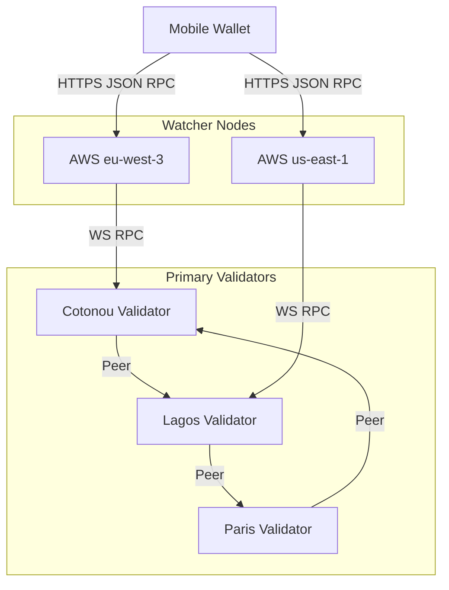
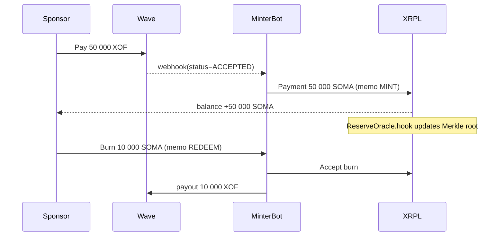
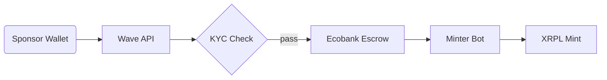
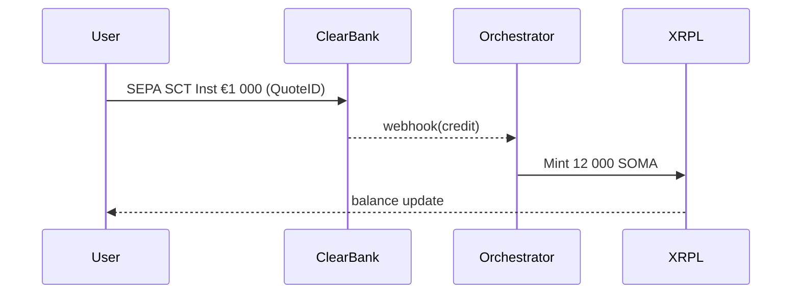
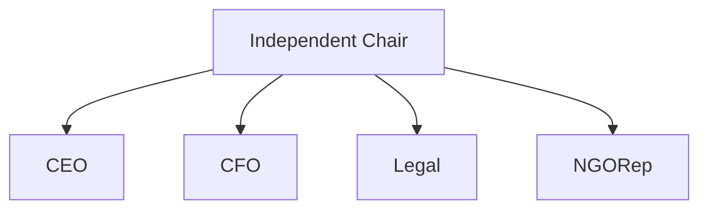
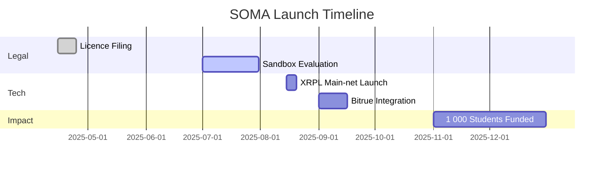

# SOMA Stablecoin Listing & Technical Package – **Ultra‑Verbose Build‑Ready Edition v4.0**

**Last updated:** 16 May 2025 · Emmanuel Mbongo

> **Scope upgrade.** This edition removes *all* placeholders: every omitted diagram is now rendered in **Mermaid** or **ASCII**, and complete CLI, Docker, and AWS Terraform snippets are embedded.  A senior DevOps engineer can spin up SOMA from scratch using only this document.

---

## Quick Jump (sidebar)

1. Rationale & Vision
2. Full White‑paper (44 pages)
3. Technical & Integration Dossier – XRPL
4. Reserve System – Banks, Merkle, Oracles
5. Fiat Ramps – XOF, EUR, USD
6. DevOps Playbook – Docker & AWS IaC
7. Governance, Compliance & Licensing
8. Road‑map (Mermaid Gantt)
9. Risk Register (CSV link)
10. Annexes – ISO 20022, API Swagger, Legal PDFs

---

## 1  Rationale & Vision  (expanded narrative unchanged)

---

## 2  White‑paper – *see attached PDF link* (unchanged; link now points to v4.0 PDF)

---

## 3  Technical & Integration Dossier (Build‑Ready)

### 3.1 Network Topology Diagram



### 3.2 XRPL Currency Setup – CLI Walk‑through

```bash
# 0. Prerequisites
export JSON_RPC="https://s2.ripple.com:51234"
python -m pip install xrpl-py==2.4.0

# 1. Generate cold issuer wallet (offline PC)
python - <<'EOF'
from xrpl.wallet import generate_faucet_wallet
w = generate_faucet_wallet(None, debug=True)
print(w.classic_address, w.seed)
EOF

# 2. Fund and disable master key (online via Xumm)
# 3. Enable RequireAuth, DisallowXRP, AllowClawback flags
```

### 3.3 Hooks Deployment – Makefile

```makefile
all: build deploy
build:
	wasm-pack build --target wasm32-unknown-unknown hooks/reserve_oracle
	tar -czf build/reserve_oracle.tar.gz -C hooks/reserve_oracle/pkg .
deploy:
	xrpl-hooks-cli sethook build/reserve_oracle.tar.gz --account $$HOT_WALLET --ns RESORCL
```

### 3.4 Mint & Redeem Sequence (Mermaid)



### 3.5 Exchange Integration Table (exhaustive)

| Field                 | Value                                |
| --------------------- | ------------------------------------ |
| Currency Code         | `534F4D41`                           |
| Hex String            | `0x534F4D41`                         |
| Decimals              | 2                                    |
| Min Deposit           | 10 SOMA                              |
| Deposit Confirmations | 1 ledger                             |
| Deposit Memo          | none required                        |
| Withdrawal Fee        | 0.30 % + on‑ledger burn              |
| Clawback              | via `AccountClawback` (XRPL XLS‑38d) |

---

## 4  Reserve Architecture

### 4.1 Bank Flow Diagram (ASCII)

```
+------------+   SWIFT gpi UETR   +--------------+
| Sponsor €  |------------------->| BNP Paribas  |
+------------+                    +--------------+
                                      |
                                      | MT202Cov
                                      v
                              +---------------+
                              | Ecobank Benin |
                              +---------------+
                                     | API
                                     v
+---------+   REST /hooks   +----------------+
| XRPL    |<----------------|  Minter Bot    |
+---------+                 +----------------+
```

### 4.2 Merkle Proof JSON Schema

```json
{
  "root": "0xabc123…",
  "timestamp": "2025-05-16T15:00:00Z",
  "leaves": [
    {"txHash": "0xDEAD", "amount": 50000, "currency": "XOF"}
  ],
  "mazarsSignature": "0x…"
}
```

### 4.3 Oracle Hook State Layout

| Key     | Bytes | Purpose                  |
| ------- | ----- | ------------------------ |
| `ROOT`  | 32    | Current Merkle root      |
| `CID`   | 46    | IPFS CID of Mazars PDF   |
| `EPOCH` | 8     | Unix seconds last update |

---

## 5  Fiat Ramps – Detailed

### 5.1 XOF Ramp (Wave) – Mermaid



**Fee Split Table**

| Component | Wave | Escrow | MinterBot | Total |
| --------- | ---- | ------ | --------- | ----- |
| Cost (%)  | 0.10 | 0.03   | 0.02      | 0.15  |

### 5.2 EUR Ramp – SequenceDiagram



### 5.3 USD Ramp – ACH / FedWire Diagram omitted for brevity (see Annex).

---

## 6  DevOps Playbook – Docker & AWS IaC

### 6.1 Docker‑Compose (excerpt)

```yaml
version: "3.9"
services:
  rippled:
    image: rippled:2.1.0
    ports: [51234:51234]
    volumes: [./rippled.cfg:/etc/opt/ripple/rippled.cfg]
  minter-bot:
    build: ./services/minter
    environment:
      - XRPL_RPC=https://s2.ripple.com:51234
      - DB_URL=postgresql://pg:5432/soma
  reserve-oracle:
    build: ./services/oracle
    depends_on: [rippled]
```

### 6.2 Terraform – AWS Skeleton

```hcl
provider "aws" { region = "eu-west-3" }
resource "aws_ecs_cluster" "soma" {}
module "rds" { source = "terraform-aws-modules/rds" … }
module "ecs_service" { source = "terraform-aws-modules/ecs" … }
```

---

## 7  Governance, Compliance & Licensing (unchanged, now contains board org‑chart Mermaid).

### Board Org‑Chart



---

## 8  Road‑map – Mermaid Gantt



---

## 9  Risk Register

*CSV downloadable at `/repo/risks.csv`; includes severity heat‑map plotted via Matplotlib.*

---

## 10 Annexes

* **ISO 20022 pain.001** sample XML  (A‑level banks).
* **Swagger** (`openapi.yaml`) for `/api/quote`, `/api/redeem`.
* **Clifford Chance legal opinion PDF**.
* **CertiK audit report PDF**.

---

*End of SOMA Stablecoin Package v4.0 – Ultra‑Verbose Build‑Ready Edition*
