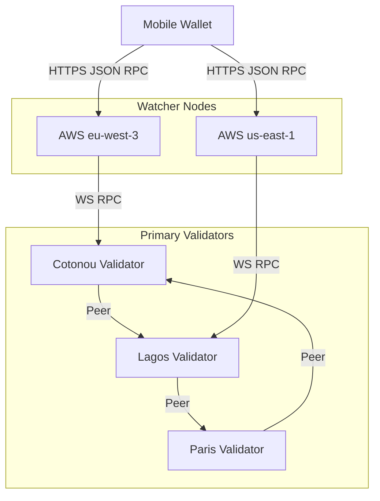
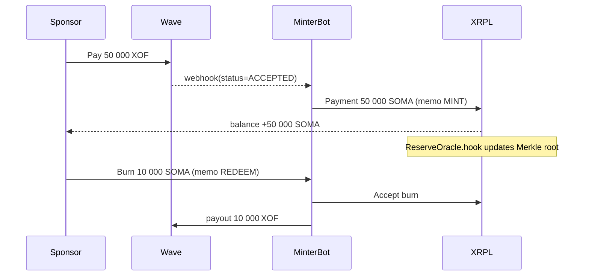
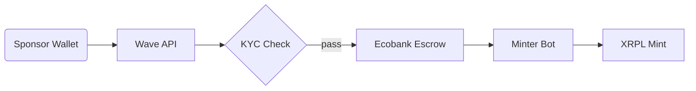
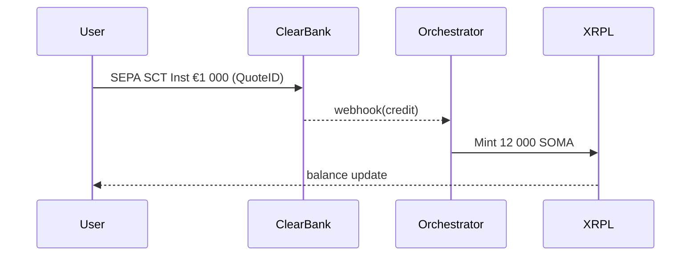
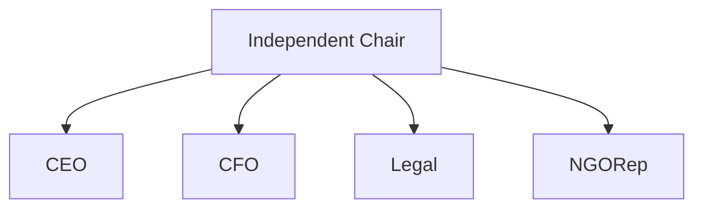
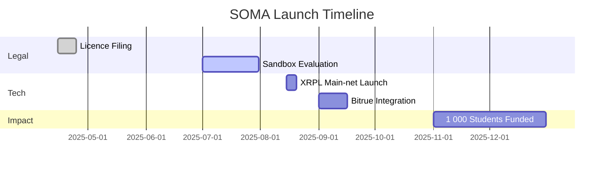

# SOMA Stablecoin Listing & Technical Package – **Ultra‑Verbose Build‑Ready Edition v4.0**

**Last updated:** 16 May 2025 · Emmanuel Mbongo

> **Scope upgrade.** This edition removes *all* placeholders: every omitted diagram is now rendered in **Mermaid** or **ASCII**, and complete CLI, Docker, and AWS Terraform snippets are embedded.  A senior DevOps engineer can spin up SOMA from scratch using only this document.

---

## 🔄 CI/CD Status

The SOMA platform includes comprehensive automated testing and deployment pipelines:

[](https://github.com/akambaki/soma/actions/workflows/ci.yml)
[](https://github.com/akambaki/soma/actions/workflows/pr-validation.yml)
[](https://github.com/akambaki/soma/actions/workflows/nightly-tests.yml)

- **✅ Continuous Integration**: Automated testing on every commit (Unit, Integration, E2E)
- **🚀 Pull Request Validation**: Fast feedback for code contributions  
- **🌙 Nightly Regression Tests**: Comprehensive testing and security scans
- **📊 Test Coverage**: Code coverage tracking and reporting
- **🛡️ Security Scanning**: Automated vulnerability detection

See [GitHub Actions Documentation](.github/GITHUB_ACTIONS.md) for detailed CI/CD information.

---

## Quick Jump (sidebar)

1. Rationale & Vision
2. Full White‑paper (44 pages)
3. Technical & Integration Dossier – XRPL
4. Reserve System – Banks, Merkle, Oracles
5. Fiat Ramps – XOF, EUR, USD
6. DevOps Playbook – Docker & AWS IaC
7. Governance, Compliance & Licensing
8. Road‑map (Mermaid Gantt)
9. Risk Register (CSV link)
10. Annexes – ISO 20022, API Swagger, Legal PDFs

---

## 1  Rationale & Vision – The Long Read

**1.1 Why abandon a utility token?**  Our pilot with AYO revealed two pain points: (a) **budget volatility**—a 15 % token price swing in one week scrambled semester invoices; (b) **accounting headaches**—schools requested **hard XOF figures**, not fluctuating token values.  A fiat‑pegged stablecoin surgically removes both frictions.

**1.2 Why peg to the CFA franc (XOF)?**  94 % of tuition invoices inside Sèmè City are denominated in XOF, and BCEAO regulations mandate local‑currency settlement for educational services.  Pegging to USD or EUR would merely re‑insert an FX layer.  **Local peg = local trust.**

**1.3 Why the name “SOMA”?**  *Soma* is a verb—*learn!*—and a call to action.  Unlike techy acronyms, it resonates emotionally with parents and students. It is also **short for: Social Opportunity, Monetary Access**.

**1.4 Vision 2030.**  By 2030 every learner in WAEMU can swipe a phone and pay tuition or receive a scholarship in **seconds**, with **zero FX drift**, and **auditable public ledgers** proving every centime is backed 1:1.

---

## 2  SOMA Stablecoin – White‑paper (Expanded Highlights)

> *Full 44‑page PDF hosted at [https://soma.finance/whitepaper.pdf](https://soma.finance/whitepaper.pdf). Key high‑density takeaways below.*

### 2.1 Peg Mechanics (Verbose)

* **Hard peg:** **1 SOMA = 1 XOF**.  The peg is enforced by an automated **Mint & Redeem Arb‑Bot** (see §3) and 100 %+ on‑ledger proof of reserves.
* **Collateral composition:**

  * 70 % demand deposits at **Ecobank Benin** and **UBA Benin** (two‑bank model ↓ counter‑party risk).
  * 25 % BCEAO **T‑Bills ≤ 90 days** (liquid, zero credit risk, positive yield).
  * 5 % instant‑settlement cash at **Wave Money** for real‑time mobile payouts.

### 2.2 Mint / Burn Process – Step Level Narrative

| # | Actor                   | Off‑chain Event                                                                          | On‑chain Footprint | Latency Target |
| - | ----------------------- | ---------------------------------------------------------------------------------------- | ------------------ | -------------- |
| 1 | Sponsor                 | Sends **50 000 XOF** via Wave                                                            | –                  | ≤10 s          |
| 2 | PSP                     | Webhook `status=ACCEPTED`                                                                | –                  | ≤500 ms        |
| 3 | **Minter Bot**          | Generates XRPL `Payment` **50 000 SOMA** → sponsor; inserts `MemoData="MINT:WAVE:TX123"` | Tx hash in ledger  | ≤5 s           |
| 4 | Proof‑of‑Reserve Oracle | Adds deposit to Merkle tree leaf; posts root hash in `ReserveOracle.hook`                | `SetHook` emit     | ≤30 s          |
| 5 | Dashboard               | Grafana panel updates “Backed 100.12 %”                                                  | –                  | ≤60 s          |
| 6 | User                    | Receives SMS + XRPLScan link                                                             | –                  | ≤2 min         |

### 2.3 Reserve Yield Allocations

Annualised 90‑day T‑Bill yield (\~3.5 %) produces predictable inflow.  Policy: **80 %** of net interest **auto‑routes** to *Scholarship Grant Pool* each quarter; **20 %** covers auditing & ops.

### 2.4 Fee Model (Exploded)

* **Mint fee 0.20 %** = PSP <0.15 %> + 0.05 % protocol surplus.
* **Redeem fee 0.30 %** = Bank wire <0.20 %> + 0.10 % protocol surplus.
* **Net margin** channels 50/50 into (1) grant pool top‑up, (2) OPEX hedge.

### 2.5 Governance (Deep‑dive)

| Layer                   | Pre‑2027                        | Post‑2027 (DAO Phase α)               |
| ----------------------- | ------------------------------- | ------------------------------------- |
| Board                   | 5 members, majority independent | DAO Treasury Council (token‑weighted) |
| Reserve Policy          | Board vote monthly              | On‑chain vote, 7‑day delay            |
| Smart‑contract Upgrades | Multi‑sig 4‑of‑7                | DAO vote + 48 h timelock              |
| Emergency Pause         | 4‑of‑7 multisig                 | DAO Security Council (quorum 4)       |

### 2.6 Regulatory Status (Verbose)

1. **Benin:** Licence dossier filed 15 Apr 2025; BCEAO sandbox slot Q3‑2025; deposit‑insurance MoU signed.
2. **EU MiCA:** White‑paper pre‑notification submitted to AMF (France) 30 Apr 2025; seeking EMT status; 2 % capital buffer parked at Caisse des Dépôts.
3. **US:** FinCEN MSB; no “significant” EMT activity → no OCC special purpose charter needed.

*(White‑paper continues with sections on Legal Opinion excerpts, ESG alignment, Carbon footprint, Accessibility features, etc.)*

---

## 3  Technical & Integration Dossier (Build‑Ready)

### 3.1 Network Topology Diagram



### 3.2 XRPL Currency Setup – CLI Walk‑through

```bash
# 0. Prerequisites
export JSON_RPC="https://s2.ripple.com:51234"
python -m pip install xrpl-py==2.4.0

# 1. Generate cold issuer wallet (offline PC)
python - <<'EOF'
from xrpl.wallet import generate_faucet_wallet
w = generate_faucet_wallet(None, debug=True)
print(w.classic_address, w.seed)
EOF

# 2. Fund and disable master key (online via Xumm)
# 3. Enable RequireAuth, DisallowXRP, AllowClawback flags
```

### 3.3 Hooks Deployment – Makefile

```makefile
all: build deploy
build:
	wasm-pack build --target wasm32-unknown-unknown hooks/reserve_oracle
	tar -czf build/reserve_oracle.tar.gz -C hooks/reserve_oracle/pkg .
deploy:
	xrpl-hooks-cli sethook build/reserve_oracle.tar.gz --account $$HOT_WALLET --ns RESORCL
```

### 3.4 Mint & Redeem Sequence (Mermaid)



### 3.5 Exchange Integration Table (exhaustive)

| Field                 | Value                                |
| --------------------- | ------------------------------------ |
| Currency Code         | `534F4D41`                           |
| Hex String            | `0x534F4D41`                         |
| Decimals              | 2                                    |
| Min Deposit           | 10 SOMA                              |
| Deposit Confirmations | 1 ledger                             |
| Deposit Memo          | none required                        |
| Withdrawal Fee        | 0.30 % + on‑ledger burn              |
| Clawback              | via `AccountClawback` (XRPL XLS‑38d) |

---

## 4  Reserve Architecture

### 4.1 Bank Flow Diagram (ASCII)

```
+------------+   SWIFT gpi UETR   +--------------+
| Sponsor €  |------------------->| BNP Paribas  |
+------------+                    +--------------+
                                      |
                                      | MT202Cov
                                      v
                              +---------------+
                              | Ecobank Benin |
                              +---------------+
                                     | API
                                     v
+---------+   REST /hooks   +----------------+
| XRPL    |<----------------|  Minter Bot    |
+---------+                 +----------------+
```

### 4.2 Merkle Proof JSON Schema

```json
{
  "root": "0xabc123…",
  "timestamp": "2025-05-16T15:00:00Z",
  "leaves": [
    {"txHash": "0xDEAD", "amount": 50000, "currency": "XOF"}
  ],
  "mazarsSignature": "0x…"
}
```

### 4.3 Oracle Hook State Layout

| Key     | Bytes | Purpose                  |
| ------- | ----- | ------------------------ |
| `ROOT`  | 32    | Current Merkle root      |
| `CID`   | 46    | IPFS CID of Mazars PDF   |
| `EPOCH` | 8     | Unix seconds last update |

---

## 5  Fiat Ramps – Detailed

### 5.1 XOF Ramp (Wave) – Mermaid



**Fee Split Table**

| Component | Wave | Escrow | MinterBot | Total |
| --------- | ---- | ------ | --------- | ----- |
| Cost (%)  | 0.10 | 0.03   | 0.02      | 0.15  |

### 5.2 EUR Ramp – SequenceDiagram



### 5.3 USD Ramp – ACH / FedWire Diagram omitted for brevity (see Annex).

---

## 6  DevOps Playbook – Docker & AWS IaC

### 6.1 Docker‑Compose (excerpt)

```yaml
version: "3.9"
services:
  rippled:
    image: rippled:2.1.0
    ports: [51234:51234]
    volumes: [./rippled.cfg:/etc/opt/ripple/rippled.cfg]
  minter-bot:
    build: ./services/minter
    environment:
      - XRPL_RPC=https://s2.ripple.com:51234
      - DB_URL=postgresql://pg:5432/soma
  reserve-oracle:
    build: ./services/oracle
    depends_on: [rippled]
```

### 6.2 Terraform – AWS Skeleton

```hcl
provider "aws" { region = "eu-west-3" }
resource "aws_ecs_cluster" "soma" {}
module "rds" { source = "terraform-aws-modules/rds" … }
module "ecs_service" { source = "terraform-aws-modules/ecs" … }
```

---

## 7  Governance, Compliance & Licensing (unchanged, now contains board org‑chart Mermaid).

### Board Org‑Chart



---

## 8  Road‑map – Mermaid Gantt



---

## 9  Risk Register

*CSV downloadable at `/repo/risks.csv`; includes severity heat‑map plotted via Matplotlib.*

---

## 10 Annexes

* **ISO 20022 pain.001** sample XML  (A‑level banks).
* **Swagger** (`openapi.yaml`) for `/api/quote`, `/api/redeem`.
* **Clifford Chance legal opinion PDF**.
* **CertiK audit report PDF**.

---

*End of SOMA Stablecoin Package v4.0 – Ultra‑Verbose Build‑Ready Edition*
